<!-- markdownlint-disable MD033 MD041 MD045 -->

<p align="center">
    <a href="https://github.com/SharpIceX">
      
    </a>
    <a href="https://github.com/SharpIceX">
      
    </a>
</p>

---

👋 Welcome to my GitHub profile!

🧭 I'm from China—**锐冰** is my Chinese name, and **SharpIce** is my English name.

⚡️ I'm an open-source volunteer who loves cute artwork and all things tech.

---

## 🛠 Tech Stack

### Professional / Intermediate

- Languages: TypeScript, JavaScript, Node.js
- Frameworks: Nuxt.js, Vue.js
- OS: Linux

### Competent / Familiar

- C#
- Java
- Python

### Newbie

- Kotlin

### Grave Property

- Lua

---

## 💬 Find Me At

- [My Website](https://sharpice.top)
- Discord: `.sharpice`**(Note the period at the beginning)** or [click here to discord app](https://discord.com/users/650534063492431891)

---

## ✏️ Roadmap

---

<div align="center">

|                    Plan                     |     Status      |
| :-----------------------------------------: | :-------------: |
| ThaumaturgySpectacle Worldbuilding Project  | 🟢 In Progress  |
| Todd's Avali Lore Guide V1.7 简体中文本地化 | 🟢 In Progress  |
|                 Nuxt Nexus                  | 🟢 In Progress  |
|    CustomPlayerModels Mod 简体中文本地化    | 🟡 Following Up |
| Minecraft IceAndFire ATM Compatibility Mod  | 🟡 Following Up |
|        Minecraft Avali Variants Mod         |    ⚪ Draft     |
|         Open Character License 1.0          |    ⚪ Draft     |
|         KDE Project 简体中文本地化          |  🔴 Postponed   |

</div>

---

## 🔐 Verification Fingerprints

### JAR Signing (KeyStore)

- KeyStore SHA-1: `0F:68:6D:99:D2:17:BC:4F:AF:29:61:F1:28:EA:20:E5:C0:DC:F5:F8`
- KeyStore SHA-256: `98:53:9C:BB:1C:C6:D7:E9:70:C7:4A:AA:E2:E7:F7:90:3F:66:85:21:5B:07:6A:7E:20:E4:5F:FD:29:A4:87:2C`

### GnuPG / PGP

- Fingerprint: `368D2B2EFB114C9D28576F01E33A3550961E333C`
- Public Key: [github.com/sharpIceX.gpg](https://github.com/sharpIceX.gpg)

```text
手持两把锟斤拷，口中疾呼烫烫烫；脚踏千朵屯屯屯，笑看万物锘锘锘。

Two 锟斤拷 clasped firm within my hands,
I shout the frantic refrain “烫烫烫”;
Upon a thousand 屯屯屯 blooms I stride,
and laugh to see the world go 锘锘锘.

一位工程师走进咖啡馆点了一份炒面，咖啡馆崩溃了

An engineer walked into a café and ordered fried noodles—the café crashed.

Boss told me to disconnect the internet, so I grabbed a pair of scissors and went for it. Now I’m fired. Anyone know why?
```

<p align="center">
    <a href="https://github.com/SharpIceX">
      
    </a>
</p>
