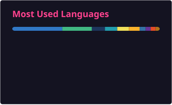

<!-- markdownlint-disable MD033 MD045 MD041 -->

<p align="center">
    <a href="https://github.com/SharpIceX">
      
    </a>
    <a href="https://github.com/SharpIceX">
      
    </a>
    <br>
    <a href="https://codetime.dev">
      
    </a>
</p>

👋 Welcome to my GitHub profile!

🧭 I'm from China—**锐冰** is my Chinese name, and **SharpIce** is my English name.

⚡️ I'm an open-source loving independent developer and CG artist. I love cute things and artwork. Most of what I do comes from interest, purely powered by love.

## 🛠 Tech Stack

### Professional / Intermediate

- OS: Linux
- Base: CI/CD, Git
- Languages: TypeScript, JavaScript
- Frameworks: Nuxt.js, Vue.js, Node.js

### Competent / Familiar

- Blender

### Newbie

- C#, Kotlin
- Reverse engineering (I use it to adapt to some black-box applications)

### Grave Property

- Lua, Java, Python
- TailwindCSS, UnoCSS, PostCSS

## 💬 Find Me At

- [My Website](https://avali.top)
- Discord: `.sharpice` **(Note the period at the beginning)** or [click here to discord app](https://discord.com/users/650534063492431891)

## ✏️ Roadmap

<div align="center">

|                                                                  Plan                                                                  |     Status      |
| :------------------------------------------------------------------------------------------------------------------------------------: | :-------------: |
| [Argon Nexus Center(My personal website, blog, fictional worldview wiki, and novels)](https://github.com/SharpIceX/Argon-Nexus-Center) | 🟢 In Progress  |
|            [Todd's Avali Lore Guide V1.7 简体中文本地化](https://github.com/SharpIceX/Todd-s-Avali-Lore-Guide-V1.7_chinese)            | 🟢 In Progress  |
|                                         [Nuxt Nexus](https://github.com/SharpIceX/nuxt-nexus)                                          | 🟡 Following Up |
|                        [CustomPlayerModels Mod 简体中文本地化](https://github.com/SharpIceX/CustomPlayerModels)                        | 🟡 Following Up |
|                                                       KDE Project 简体中文本地化                                                       |  🔴 Postponed   |

</div>

## 🔐 Verification Fingerprints

### JAR Signing (KeyStore)

- KeyStore SHA-1: `0F:68:6D:99:D2:17:BC:4F:AF:29:61:F1:28:EA:20:E5:C0:DC:F5:F8`
- KeyStore SHA-256: `98:53:9C:BB:1C:C6:D7:E9:70:C7:4A:AA:E2:E7:F7:90:3F:66:85:21:5B:07:6A:7E:20:E4:5F:FD:29:A4:87:2C`

### GnuPG / PGP

- Fingerprint: `368D 2B2E FB11 4C9D 2857  6F01 E33A 3550 961E 333C`
- Public Key: [github.com/sharpIceX.gpg](https://github.com/sharpIceX.gpg)

### 🎵 Want some music?

<table border="0">
  <tr>
    <td>
      <a href="https://www.youtube.com/watch?v=xkUN_9HFNPg">
        
      </a>
    </td>
    <td>
      <a href="https://www.youtube.com/watch?v=s0K53t4dNyg">
        
      </a>
    </td>
  </tr>
  <tr>
    <td>
      <a href="https://www.youtube.com/watch?v=BJU0E1KHjzk">
        
      </a>
    </td>
    <td>
      <a href="https://www.youtube.com/watch?v=Z-OMz0rVQd0">
        
      </a>
    </td>
  </tr>
</table>

---

```text
手持两把锟斤拷，口中疾呼烫烫烫；脚踏千朵屯屯屯，笑看万物锘锘锘。

Two 锟斤拷 clasped firm within my hands,
I shout the frantic refrain “烫烫烫”;
Upon a thousand 屯屯屯 blooms I stride,
and laugh to see the world go 锘锘锘.

一位工程师走进咖啡馆点了一份炒面，咖啡馆崩溃了

An engineer walked into a café and ordered fried noodles—the café crashed.

Boss told me to disconnect the internet, so I grabbed a pair of scissors and went for it. Now I’m fired. Anyone know why?
```
